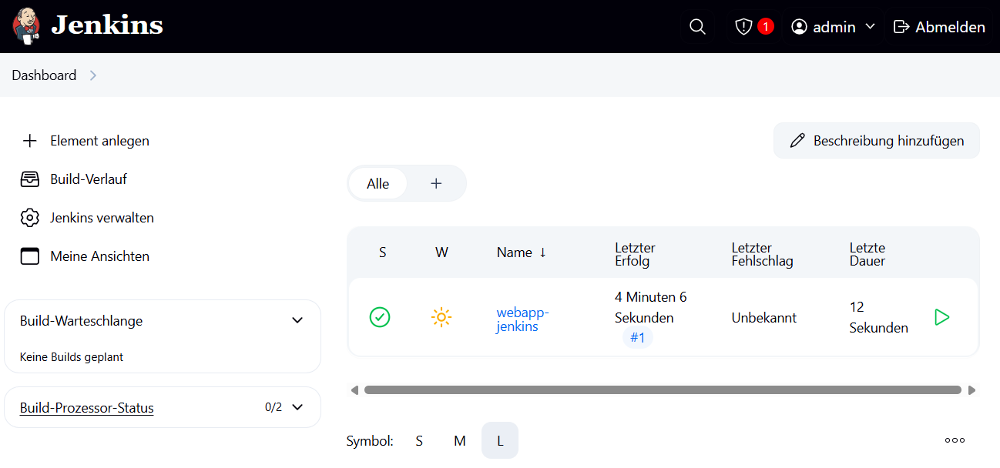
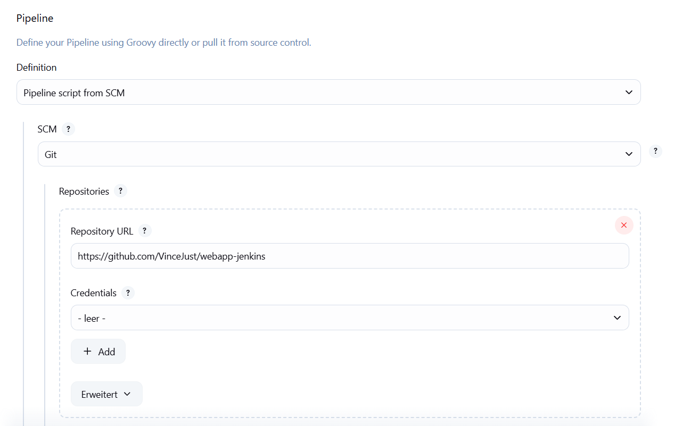
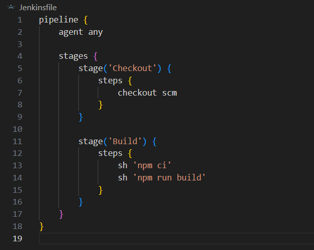
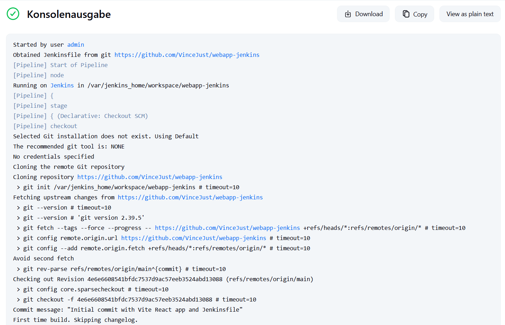
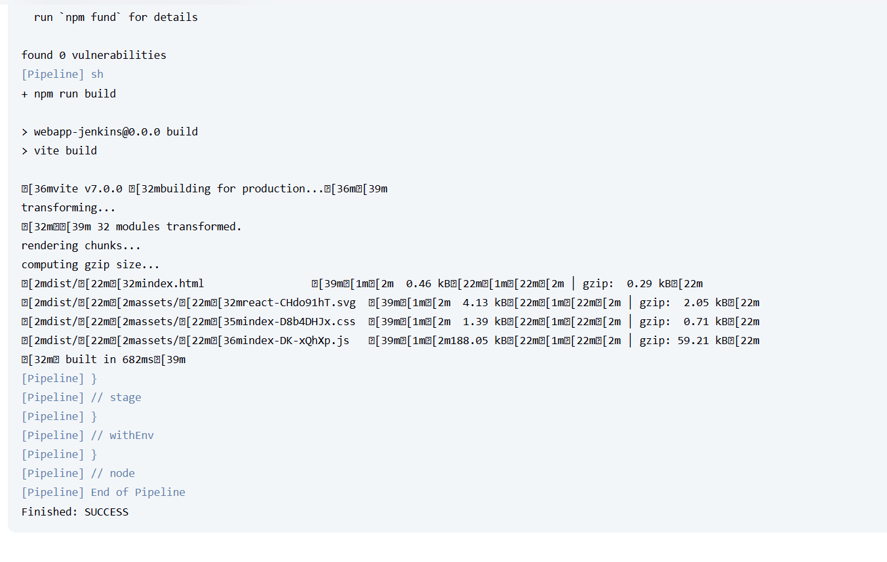

# Jenkins CI Pipeline für Vite React Webanwendung

## Aufgabe

**Ziel:** Erste Jenkins Pipeline - Jenkins aufsetzen und Web-App bauen

In dieser Jenkins-Einführung wurde eine einfache CI-Pipeline erstellt. Ziel war es, eine lokale Jenkins-Instanz mittels Docker aufzusetzen, den Jenkins-Workflow zu verstehen und eine einfache Pipeline zu erstellen, die den Code einer Vite React Webanwendung aus einem Git-Repository klont und den Build-Prozess startet.

**Lernziele erreicht:**
- Jenkins Master-Instanz lokal mit Docker gestartet und konfiguriert
- Jenkins-Installation (Unlock, Plugins, Admin User) durchlaufen
- Pipeline-Job konfiguriert mit Git-Repository Integration
- Jenkinsfile mit Declarative Pipeline erstellt
- Pipeline-Stufen Checkout und Build definiert
- Erfolgreicher Pipeline-Lauf mit Build-Prozess

---

## Projektstruktur

Dieses Repository enthält:

- Eine einfache Vite-React-Webanwendung
- Ein `Jenkinsfile` im Wurzelverzeichnis zur Definition der CI-Pipeline
- Custom Jenkins Docker Setup im `jenkins-custom/` Ordner:
  - `Dockerfile` - Jenkins-Image mit Node.js
  - `start.sh` - Automatisiertes Build- und Start-Script
- Screenshots zur Dokumentation im `screenshots/` Ordner

---

## Voraussetzungen

Vor der Ausführung müssen folgende Tools installiert sein:

- Docker (zum Starten von Jenkins)
- Git
- Node.js + npm (für den Build der App)

---

## Jenkins Setup

### 1. React App erstellen

```bash
npm create vite@latest webapp-jenkins -- --template react
cd webapp-jenkins
npm install
git init
git add .
git commit -m "Initial commit"
git remote add origin https://github.com/VinceJust/webapp-jenkins
git push -u origin main
```

### 2. Custom Jenkins Image mit Node.js erstellen

Da Jenkins standardmäßig kein Node.js enthält, wurde ein benutzerdefiniertes Docker-Image erstellt:

**Dockerfile** (`jenkins-custom/Dockerfile`):
```dockerfile
FROM jenkins/jenkins:lts

USER root

RUN curl -fsSL https://deb.nodesource.com/setup_22.x | bash - \
    && apt-get update \
    && apt-get install -y nodejs git

USER jenkins
```

**Automatisiertes Start-Script** (`jenkins-custom/start.sh`):
```bash
#!/bin/bash

docker build -t my-jenkins-node .

docker stop my-simple-jenkins 2>/dev/null || true
docker rm -v my-simple-jenkins 2>/dev/null || true

docker run --name my-simple-jenkins \
  -p 8080:8080 \
  -v jenkins_home:/var/jenkins_home \
  my-jenkins-node
```

**Jenkins starten:**
```bash
cd jenkins-custom
chmod +x start.sh
./start.sh
```

**Installation über die Weboberfläche:**
- `http://localhost:8080` aufrufen
- Unlock Jenkins mit Initial-Passwort (`docker logs my-simple-jenkins`)
- "Install suggested plugins" wählen
- Admin-User anlegen
- Dashboard aufrufen

**Screenshot - Jenkins Dashboard:**



### 3. Pipeline-Job anlegen

- Neuer Item: `webapp-jenkins`
- Typ: Pipeline
- SCM: Git Repository
- Branch: `*/main`
- Script Path: `Jenkinsfile`

**Screenshot - Pipeline Konfiguration:**



---

## Jenkinsfile

Das Jenkinsfile befindet sich im Root-Verzeichnis und definiert zwei Stages:

- **Checkout**: Klont den Code aus dem Git-Repository
- **Build**: Installiert Dependencies und baut die Webanwendung mit Vite


**Screenshot - Jenkinsfile:**



---

## Pipeline-Ausführung

Der Pipeline-Lauf wurde manuell über die Jenkins-Oberfläche gestartet. Die Konsole zeigt einen erfolgreichen Build:

**Screenshot - Pipeline gestartet:**



**Screenshot - NPM Build wird ausgeführt:**


**Screenshot - Build erfolgreich abgeschlossen:**



---

## Reflexion

**1. Welche Schritte waren notwendig, um Jenkins lokal mit Docker zum Laufen zu bringen?**

Custom Docker-Image mit Node.js erstellen, Container starten, Web-UI konfigurieren (Unlock, Plugins, Admin-User).

**2. Was ist der Zweck der Datei Jenkinsfile, und wo muss sie im Verhältnis zu deinem Anwendungscode liegen?**

Definiert die CI-Pipeline als Code. Muss im Root-Verzeichnis des Git-Repositories liegen.

**3. Beschreibe die zwei Hauptstages, die du in deiner Pipeline definiert hast, und was der Hauptzweck der Steps in jeder Stage ist.**

**Checkout**: Code aus Git holen. **Build**: Dependencies installieren (`npm ci`) und App bauen (`npm run build`).

**4. Wie hast du in Jenkins konfiguriert, von welchem Git-Repository und welchem Branch der Code für die Pipeline geholt werden soll?**

Pipeline-Konfiguration: "Pipeline script from SCM", Git-URL eingeben, Branch `*/main` wählen.

**5. Was ist der Unterschied zwischen dem `checkout scm` Step in deiner Pipeline und dem `git clone` Befehl, den du manuell im Terminal ausführen würdest?**

`checkout scm` nutzt Jenkins-Konfiguration automatisch. `git clone` ist manueller Befehl ohne Jenkins-Kontext.

---

## Technische Details

- **Custom Jenkins Image**: `my-jenkins-node` (basierend auf `jenkins/jenkins:lts`)
- **Node.js Version**: 22.x (im Custom Image installiert)
- **Build Tool**: Vite
- **Package Manager**: npm
- **Git Branch**: main
- **Port**: 8080 (Jenkins Webinterface)
- **Docker Volume**: `jenkins_home` (für Persistenz)
